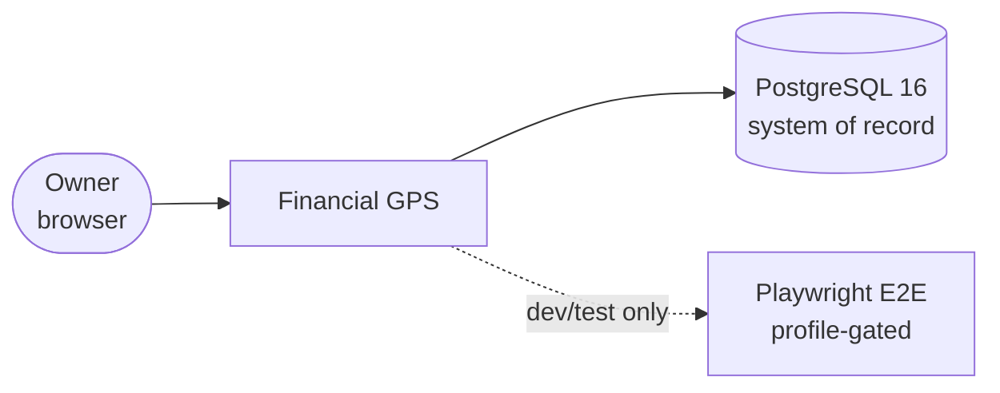
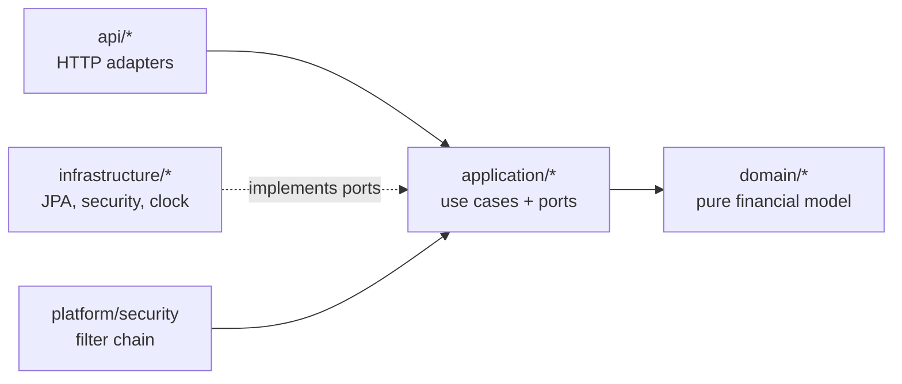

# C4 Container Diagram

Level 1 (system context) and Level 2 (containers) for Financial GPS.
For actors and trust boundaries, see [system-context.md](system-context.md);
for deploy-time topology, see [deployment.md](deployment.md).

## Level 1 — System context



- There is exactly one human actor: the account owner. No admin UI, no service accounts.
- The system has no outbound dependencies at runtime (no email, no payments, no third-party APIs).
  The only network egress is the container image registries at build time.

## Level 2 — Containers (local compose)

```mermaid
flowchart LR
    Browser([Browser]) -->|":4173<br/>Vite dev"| FE[Frontend<br/>Vue 3 SPA]
    FE -->|"/api/* proxied<br/>same-origin"| BE[Backend<br/>Spring Boot 3.2 / Java 21<br/>":8080"]
    BE -->|"JDBC<br/>postgres:5432"| PG[(PostgreSQL 16)]
    E2E[Playwright<br/>profile e2e] -->|E2E_BASE_URL| FE
```

| Container | Local origin | In-cluster origin | Responsibility |
|---|---|---|---|
| Frontend | `127.0.0.1:4173` (Vite dev, proxies `/api` → backend) | nginx on `:8080`, proxies `/api/` → `http://backend:8080` | Presentation only. No financial math, no totals — renders server responses verbatim |
| Backend | `:8080` (`/actuator/health`) | `backend:8080`, 2 replicas | Use cases, domain engine, auth/session, ownership checks |
| PostgreSQL 16 | `127.0.0.1:5434` | `postgres:5432` (StatefulSet, 5Gi PVC) | System of record, incl. Spring Session JDBC tables |
| E2E | profile-gated, not started by default | — | Only test proving real-cookie auth over HTTP |

Key constraints (enforced by config, not convention):

- Frontend reaches the backend same-origin in both environments, so cookies
  (`SESSION`, `XSRF-TOKEN`) flow with zero CORS configuration.
- DNS names are contractual in-cluster: the Service **must** be named `backend`
  (nginx hardcodes `proxy_pass http://backend:8080`) and `postgres`
  (JDBC URL `postgres:5432`).
- `DB_PASSWORD` has no default anywhere — compose and Spring both fail fast when unset.

## Level 3 — Backend components (summary)

Inside the backend process, package-level ports-and-adapters boundaries apply
(see [ADR 0004](../decisions/adr-0004-ports-and-adapters-ddd-boundaries.md)):



- `api` owns no financial rule and no clock. `LocalDate` arrives via the `BusinessDate` port.
- `application` never imports Spring, JPA, `infrastructure`, `api`, or `platform` (guarded by `ArchitectureGuardTest`).
- `domain` never depends on framework or identity types (guarded by `DomainBoundaryGuardTest`).

## Related documents

- [overview.md](overview.md) — one-page summary
- [system-context.md](system-context.md) — actors and boundaries
- [data-model.md](data-model.md) — persistence schema
- [api-contract.md](api-contract.md) — HTTP surface
- [deployment.md](deployment.md) — compose and Kubernetes runtime
