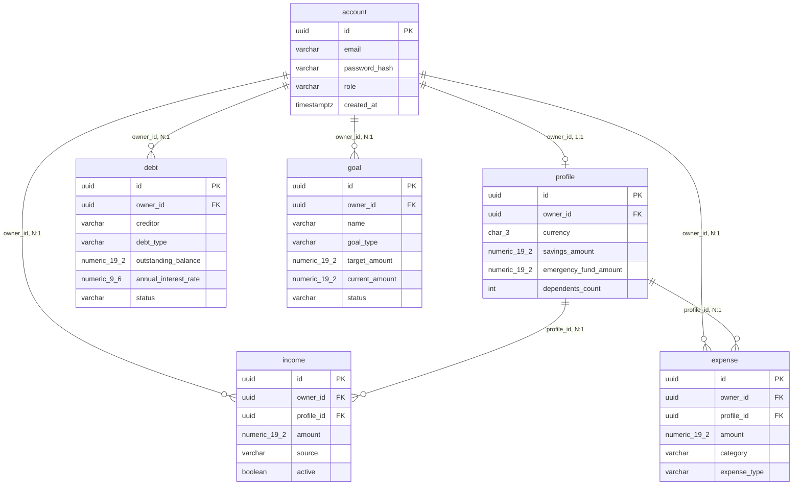

# Data Model

Persistence schema for Financial GPS (PostgreSQL 16, Flyway-migrated).
For the framework-free domain meaning of these records, see
[business-domain.md](business-domain.md) and `specs/financial-domain/`.

## Entity-relationship diagram

## Tables

| Table | PK | Owner FK | Notes |
|---|---|---|---|
| `account` | `id` UUID | — (is the owner) | `ux_account_email_lower ON lower(email)`: email unique case-insensitively, display case preserved |
| `profile` | `id` UUID | `owner_id → account(id) ON DELETE CASCADE` | `ux_profile_owner`: exactly one profile per owner |
| `income` / `expense` | `id` UUID | `owner_id → account(id) CASCADE` + `profile_id → profile(id) CASCADE` | `active` flag; `expense.expense_type` is `FIXED`/`VARIABLE` |
| `debt` | `id` UUID + `@Version` optimistic lock | `owner_id → account(id) CASCADE` | `status` `ACTIVE`/`PAID_OFF`/`ARCHIVED` (soft delete via archive); `original_principal` nullable (unknown ≠ 0); `payment_marked_on` manual marker, moves no money |
| `goal` | `id` UUID + `@Version` optimistic lock | `owner_id → account(id) CASCADE` | `status` `ACTIVE`/`COMPLETED`/`ARCHIVED` (soft delete via archive); `completion_condition = 'AMOUNT_REACHED'` |
| `SPRING_SESSION` + `SPRING_SESSION_ATTRIBUTES` | session PK | — | `ON DELETE CASCADE`; server-side sessions, 30 min idle timeout |

Indexes: `ix_*_owner` on every owner table plus `ix_debt_owner_status` and
`ix_goal_owner(_status)` for the summary/list queries.

## Conventions (load-bearing)

1. **Every domain table carries `owner_id`.** Repositories scope all reads/writes by
   owner; cross-owner access returns indistinguishable `404 RESOURCE_NOT_FOUND`
   (see [ADR 0003](../decisions/adr-0003-ownership-based-authorization-and-resource-hiding.md)).
   `OwnershipQueries` derives the table registry from `information_schema`, so a new
   owner table is automatically covered by the cascade/zero-orphan tests.
2. **Account deletion is a hard delete with FK-cascade + zero-orphan guarantee.**
   Debt/goal "deletion" is a soft archive (`ARCHIVED`); only the account itself is removed.
3. **Money is `numeric(19,2)`; rates are `numeric(9,6)` fractions.** No floats anywhere.
4. **JPA entities hold raw UUIDs, not object relations.** There are no `@ManyToOne`
   mappings; joins are explicit and owner-scoped in repository queries.
5. **Migrations are Flyway SQL (`V1__` auth/session, `V2__` profile/income/expense,
   `V3__`+ debt, `V4__`+ nullable principal, `V5__` payment mark, `V7__` goals).**
   Schema changes ship as new `V__` files, never edits.

## Related documents

- [business-domain.md](business-domain.md) — domain meaning of each record
- [security.md](security.md) — ownership checks and session storage
- [api-contract.md](api-contract.md) — how rows are exposed over HTTP
