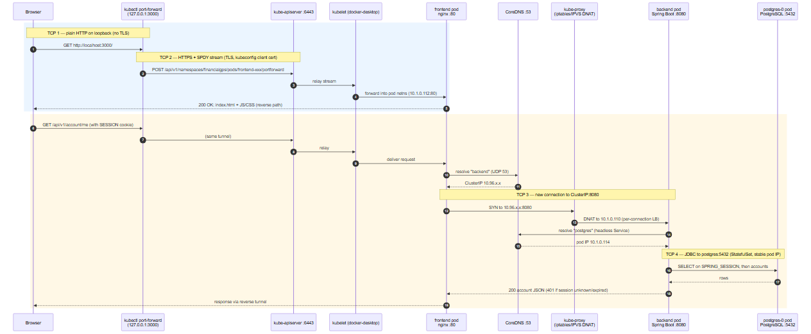

# Kubernetes manifests — financial-gps

Maps 1:1 to `compose.yaml`: **postgres** (StatefulSet) → **backend** (Spring Boot)
→ **frontend** (nginx SPA, proxies `/api/` to the backend).

## Layout

```text
k8s/
  base/                    # prod-like baseline (cookie.secure=true, hardened pods)
    namespace.yaml         # financialgps namespace
    configmap.yaml         # non-sensitive config + graceful shutdown
    secret.example.yaml    # template only — real secret created out-of-band
    postgres.yaml          # StatefulSet + headless Service + 5 Gi PVC
    backend.yaml           # Deployment (2 replicas) + Service backend:8080
    frontend.yaml          # Deployment (2 replicas, unprivileged nginx) + Service frontend:80
    networkpolicy.yaml     # default-deny ingress + allow-lists per tier
    pdb.yaml               # PodDisruptionBudgets (backend, frontend)
    backup-cronjob.yaml    # nightly pg_dump → PVC, 7-day retention
    ingress.yaml           # Ingress → frontend (TLS block commented)
    kustomization.yaml
  overlays/
    dev/                   # local clusters ONLY: activates Spring "local" profile
                           # (cookie.secure=false → browser login over HTTP works)
```

## DNS contract (mirrors compose)

- Backend connects to `jdbc:postgresql://postgres:5432/...` → Service **postgres**
- Frontend nginx has `proxy_pass http://backend:8080;` hardcoded → Service **backend**
- Keep these Service names (or update the config) when renaming.

## Deploy

```bash
# 1. Build images (or push to your registry and set tags in kustomization.yaml)
docker build -t financialgps/backend:local  backend/
docker build -t financialgps/frontend:local frontend/
# kind/minikube only — make local images visible to the cluster:
# kind load docker-image financialgps/backend:local financialgps/frontend:local

# 2. Create the database secret (no default password exists by design)
kubectl create secret generic financialgps-db \
  --namespace financialgps \
  --from-literal=DB_PASSWORD='<strong-password>'

# 3a. Local cluster (Docker Desktop/kind/minikube) — allows HTTP browser login:
kubectl apply -k k8s/overlays/dev

# 3b. Prod-like baseline (HTTPS required for login):
# kubectl apply -k k8s/base

# 4. Watch rollout
kubectl -n financialgps get pods -w
```

## Access

### Port-forward (quickest — no Ingress needed)

```bash
kubectl -n financialgps port-forward svc/frontend 3000:80
# → open http://localhost:3000
```

Syntax: `port-forward svc/frontend <LOCAL-PORT>:<SERVICE-PORT>`.
The left port is your machine (pick any free port), the right port is the
frontend Service (nginx, always 80).

### Port cheat-sheet

| Port | What it is |
|---|---|
| `3000` | Your machine → browser (arbitrary; any free local port works) |
| `80` | **frontend** Service port (maps to container `8080`, unprivileged nginx) |
| `8080` | **backend** Service/container port — cluster-internal only |
| `5432` | **postgres** — cluster-internal only |

> ⚠️ **Browser login needs the `local` profile over HTTP.** The base sets
> `cookie.secure=true` (HTTPS only). `overlays/dev` adds
> `SPRING_PROFILES_ACTIVE=local` (`cookie.secure=false`) — use it for local
> click-around testing, never anywhere public.

### Network flow (what happens when you open http://localhost:3000)



Hops of note: TCP ❶ browser→kubectl is plain HTTP on loopback; TCP ❷
kubectl→apiserver is the TLS/SPDY tunnel (and port-forward pins **one** pod —
no load balancing); TCP ❸ nginx→backend is a fresh cluster-internal connection
via CoreDNS + kube-proxy DNAT (per-connection LB); TCP ❹ backend→postgres is a
JDBC connection to the StatefulSet's stable pod IP (the backend is stateless —
sessions live in `SPRING_SESSION`, data in the postgres PVC). Source:
[`docs/k8s-network-flow.mmd`](../docs/k8s-network-flow.mmd).

### Ingress (real deployments)

Set a real `host` and enable the commented `tls:` block in `ingress.yaml`
(e.g. with cert-manager), then browse to that host.

## Hardening (from the senior DevOps review)

- **Pod security**: `runAsNonRoot` + `readOnlyRootFilesystem` + drop ALL
  capabilities on backend/frontend/backup containers; frontend moved to
  `nginxinc/nginx-unprivileged` (uid 101, port 8080); writable scratch via
  `emptyDir` at `/tmp`.
- **Probe split**: liveness = `/actuator/health/liveness` (no DB check),
  readiness = `/actuator/health/readiness` (includes DB) — a postgres blip now
  drops traffic instead of restarting pods.
- **NetworkPolicies**: default-deny ingress; postgres ← backend only,
  backend ← frontend only, frontend ← edge. (Docker Desktop accepts but does
  not enforce them; a policy-capable CNI will.)
- **No SA tokens**: `automountServiceAccountToken: false` everywhere.
- **JVM heap**: `JAVA_TOOL_OPTIONS=-XX:MaxRAMPercentage=75.0`.
- **Graceful shutdown**: `server.shutdown=graceful` + 20s lifecycle timeout +
  60s `terminationGracePeriodSeconds`.
- **PDBs**: `minAvailable: 1` for backend/frontend (none for single-replica
  postgres — it would block node drains).
- **Backups**: nightly `pg_dump` CronJob → dedicated PVC, 7-day retention.

## Backups

```bash
# Manual backup now:
kubectl -n financialgps create job --from=cronjob/postgres-backup pgdump-manual

# List backups:
kubectl -n financialgps exec postgres-0 -- ls -lh /var/lib/postgresql/backups 2>/dev/null || \
kubectl -n financialgps exec -it deploy/backend -- true # (backups live on the postgres-backup PVC)

# Restore (downtime window): port-forward postgres, then
#   gunzip -c backup.sql.gz | psql -h 127.0.0.1 -U financialgps financialgps
```

⚠️ A PVC in the same cluster is not off-site backup — ship dumps to object
storage or use an operator with PITR for real DR.

## Verify the deployment

```bash
kubectl -n financialgps get pods

kubectl -n financialgps run verify --rm -i --image=curlimages/curl --restart=Never --quiet -- \
  sh -c "curl -s http://backend:8080/actuator/health/liveness; \
         curl -s http://backend:8080/actuator/health/readiness; \
         curl -s -o /dev/null -w '%{http_code}\n' http://frontend/; \
         curl -s -o /dev/null -w '%{http_code}\n' http://frontend/api/v1/auth/csrf"
# Expected: {"status":"UP"} x2  /  200  /  200

# Full auth flow over HTTP (works because overlays/dev sets the local profile):
curl -c cj.txt localhost:3000/api/v1/auth/csrf -o /dev/null
TOKEN=$(awk '/XSRF-TOKEN/ {print $7}' cj.txt)
curl -b cj.txt -c cj.txt -X POST localhost:3000/api/v1/auth/register \
  -H 'Content-Type: application/json' -H "X-XSRF-TOKEN: $TOKEN" \
  -d '{"email":"you@example.com","password":"correct horse battery1"}'
curl -b cj.txt localhost:3000/api/v1/account/me
```

## Production notes

- **TLS is required** with the base profile — enable `tls:` in `ingress.yaml`.
- **Migrations:** Flyway runs on backend startup; its lock table makes
  multi-replica rollouts safe.
- **Sessions** live in the DB → backend replicas are stateless, scale freely.
- **Probes:** backend gets up to 5 minutes to start (JVM + Flyway) via
  `startupProbe`.
- The **e2e** stack (Playwright) is intentionally not deployed — it belongs to CI.

## Redeploy after code changes

```bash
docker build -t financialgps/backend:local backend/     # and/or frontend/
kubectl -n financialgps rollout restart deployment/backend
kubectl -n financialgps rollout status  deployment/backend
```

## Troubleshooting

- **`./mvnw: not found` during `docker build`** — CRLF line endings from a
  Windows checkout. Fixed via `mvnw text eol=lf` in `.gitattributes` + a
  `tr -d '\r'` guard in `backend/Dockerfile`. For existing checkouts:
  `git add --renormalize mvnw`.
- **frontend CrashLoop `mkdir() "/tmp/proxy_temp" failed (30: Read-only file
  system)`** — the unprivileged nginx image keeps temp paths in `/tmp`; the
  `emptyDir` mount at `/tmp` is mandatory (already in `base/frontend.yaml`).
- **Backend pods stuck `0/1` for a few minutes** — normal: JVM start + Flyway;
  the `startupProbe` allows up to 5 min. `kubectl -n financialgps logs -f deploy/backend`.
- **`CreateContainerConfigError`** — the DB secret is missing:
  `kubectl create secret generic financialgps-db -n financialgps
  --from-literal=DB_PASSWORD='<strong-password>'`.
- **port-forward stops working after a rollout** — expected: the tunnel pins
  ONE pod, and rollouts replace pods. Re-run the port-forward command.
- **Login doesn't stick over plain HTTP** — you're on the base profile; apply
  `k8s/overlays/dev` (or use HTTPS).
